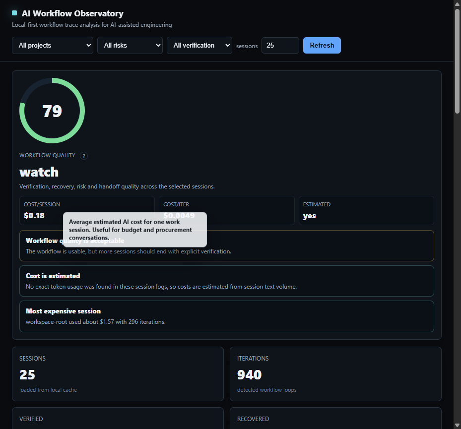

# AI Workflow Observatory

> Local-first observability for AI-assisted engineering workflows.

AI Workflow Observatory scans local Codex session logs and reconstructs the engineering loop behind AI-assisted work:

- context gathering
- planning
- implementation
- verification
- failure recovery
- final handoff

The goal is not only to count tokens or sessions. The goal is to understand how the workflow behaved.



## Product Thesis

AI coding tools are useful, but teams need more than a final answer.

They need to understand:

- whether the agent read the code before editing
- whether it tested after changing files
- whether it recovered from failures
- whether it got stuck in repeated edit/test/fix loops
- whether the final answer was verified or just optimistic

This project models that missing local observability layer.

## What It Shows

- Codex JSONL session parser
- SQLite-backed local cache
- workflow phase classification
- iteration counting
- verification quality scoring
- risk flags for unverified or unresolved sessions
- multi-currency cost estimation in USD, EUR, and PLN
- project-level summary
- terminal dashboard inspired by AI coding observability tools
- FastAPI web dashboard
- manager-friendly hover and click tooltips for explaining workflow metrics
- Markdown and JSON export

## Quickstart

```powershell
python -m venv .venv
.\.venv\Scripts\Activate.ps1
pip install -e .[dev]
aiwo
```

By default, `aiwo` scans:

```text
~/.codex/sessions
```

Scan a specific directory or file:

```powershell
aiwo --path C:\Users\syfsy\.codex\sessions --limit 20
aiwo scan --limit 100
aiwo trace 0
aiwo export --format markdown --output report.md
aiwo export --format compact-json
```

Run the web dashboard:

```powershell
python -m uvicorn ai_workflow_observatory.web:app --host 127.0.0.1 --port 8765
```

Open:

```text
http://127.0.0.1:8765
```

The cache is stored locally at:

```text
~/.ai-workflow-observatory/observatory.sqlite
```

## Workflow Signals

The MVP uses deterministic heuristics:

| Signal | Meaning |
| --- | --- |
| file reads / search | exploration |
| assistant planning text | planning |
| patch/edit/write calls | implementation |
| pytest/ruff/mypy/build/git checks | verification |
| traceback/failure/error output | debugging |
| final/done/completed text | handoff |

## Example Assessment

```text
Pattern: code-change-with-test
Iterations: 2
Verification: recovered
Risk: low

Trace:
exploration -> planning -> implementation -> verification -> debugging -> implementation -> verification -> handoff
```

## Why This Fits My Portfolio

This is a local observability and evaluation layer for AI-assisted engineering workflows.

It connects directly to the same engineering themes as my other projects:

- agent workflow review
- auditability
- evaluation
- operational control
- human-readable evidence
- local-first privacy

It is built as a practical AI systems project rather than a prompt demo: parsing real local workflow traces, converting them into structured signals, and exposing them through an operator-facing dashboard.

## Roadmap

- Claude Code session parser
- Cursor session parser
- Textual interactive dashboard
- MCP server exposing workflow summaries to agents
- Git diff correlation
- LLM-generated session summaries as an optional local/hosted mode

See [docs/PRODUCT_ROADMAP.md](docs/PRODUCT_ROADMAP.md) for the product roadmap.
